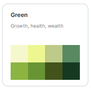
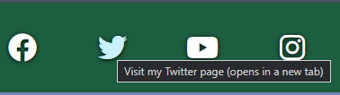
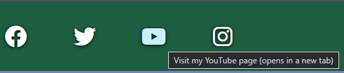

# Renterprise - The Program

***Click this banner to load the website.***

An initial prototype for a booking system. To create orders for customers and provide them with hired equipment. This example is based on a company hiring mobility equipment. However, the stock is based on what your provide to it. Flexibility is key to this software.

More people are turning to rentals as the world finances are in disarray and they can have your product at a much more managable cost. 

**This software will improve your hire bookings right from the start!**

# User Experience Design

## Target Audience
- Current business owners ready to make a change to their software.
- A consumer who is ready to take on a new challenge.

## User Stories
- I want reliable software
    1. Bug checking is imperitive.
    2. Simple but effective. Simplicity makes for fewer errors!
- I want to be able to navigate freely and quickly through the software
    1. The main menu takes you to the core details.
    2. Create the customer, find current customers and log repairs all from the main menu.
    3. You can return to the main menu at nearly all times by just entering M/m into valid fields.
    4. The process is intuitive, it guides you through.
- I want to customise my stock
- [x]  Using Google Sheets, the stock can be anything you want.
- [x]  Set a type, set a name, pricing and that is all you need.

## Wireframe Program Flow
Program flow wireframe was created using Figma[^1]. The image shows the processes through the stages of the software.
Some are still in design phase. Majority implemented.

## Logo
The logo was created using the website LOGO.com[^2]. It has been pulled from my previous Renterprise project for Portfolio 1[^4].

### Logo Process - Redocumented from Portfolio 1.
Using their step by step builder a full brand could be created from scratch, firstly the selection of software industry was chosen as it was accurate and appropriate.

Next, it gave an overall palette choice, blues, greens etc. Given the fact that a product is trying to be sold, and green symbolises wealth it seemed like a logical decision.

The creator then asked for a styling of the font to be used, a modern font was the best choice as it is for a modern product.

The final font choice for the logo was then made and it displayed the generated logo with it.

This was then the branding provided.

## Breakdown of Design

### Colour Theme
Colour theme was initially chosen and subsequently revised with Coolors.[^3] 
The overall palette was picked with the website tools which enabled complementary and contrasting colour choices based upon the initial colour from the logo.

# Features

## Existing Features

###

### Footer
A responsive social media links area included in the footer of the page, it scales the size of the Fontawesome[^17]
icons decreases/increases on the pages. Each one has an aria-label which describes where the link goes to and explains that it will open
in a separate window. The footer also includes the same blue hover as the menu, for consistency and clarity to the user.

#### Facebook

#### Twitter (Now "X/Twitter")

#### YouTube

#### Instagram

## Proposed Features

# Testing

## PEP8 Linter

Using the Code Institute Python Linter[^100]. I ran each of my .py files through it. All came back successfully with no issues.

|  File        | Result                                                                      |
|--------------|-----------------------------------------------------------------------------|
| run.py       | [View](readme/linter/run-linter.png "Result of run.py Linter").             |
| customers.py | [View](readme/linter/customers-linter.png "Result of customers.py Linter"). |
| items.py     | [View](readme/linter/items-linter.png "Result of items.py Linter").         |
| loading.py   | [View](readme/linter/loading-linter.png "Result of loading.py Linter").     |
| orders.py    | [View](readme/linter/orders-linter.png "Result of orders.py Linter").       |

## Manual Testing

This section is broken down into the different areas of the program and to how it is expected to function.

### Main Menu

- [x] Invalid option choice returns error?     
- [x] Invalid choice returns to the question?  
- [x] Navigates to Create Customer?            
- [x] Navigates to Search Customer?            
- [x] Navigates to Item Repair?                

### Create Customer

- [x]  Allow inputs to fields for name and address?         
- [x]  Invalid choice returns to the question?              
- [x]  Validate inputs? (Checks if not empty and responds)  
- [x]  Display process in action of adding to Google Sheet? 
- [x]  When created go to customer?                         
- [x]  Allow customer to select customer menu options?      

### Search Customer

- [x]  Validate search option choice for correct entries?           
- [x]  Validate search option choice against no entry?             
- [x]  Re-entry when failed validation on choice?                   
- [x]  "Search Input" Check for blank entry and throw error?        
- [x]  "Search Input" Ask again for input?                          
- [x]  Ask for input again into same category (eg. Customer Name)?  
- [x]  Provide feedback when searching?                             
- [x]  Show search results when available?                       
- [x]  Load customer without choice if only one order?              
- [x]  Choose customer from search result?
- [x]  Search by Customer Name?
- [x]  Search by Address?
- [x]  Search by Postcode?
- [x]  Search by Customer Number?
- [x]  Search by Order Number?
- [x]  Search by Invoice Number?
- [x]  Search by Item Number?

### Repair Item

- [x]  Display repairs list after loading from menu?
- [x]  Ask to choose repair? (1, 2, 3 ...)
- [x]  Ask if repair to be completed on one item, when only 1 available?
        (It does this by prompting Y/N/)
- [x]  Give feedback that repair is saving?
- [x]  Give feedback when repair save is complete?

### Customer Screen

#### Options - Add New Order

- [x]  Display type options?
- [x]  Validate wrong/empty type choices?
- [x]  Display item choices?
- [x]  Show available items based on type?
- [x]  Validate wrong/empty item choices?
- [x]  Display date picker?

##### Options - Add New Order - Dates

- [x]  Delivery format adhered to?
- [x]  Empty delivery invalid?
- [x]  Delivery date (eg. 33/55/2001) invalid?
- [x]  Feedback a valid delivery?
       (Does this by turning text green)
- [x]  Collection format adhered to?
- [x]  Empty Collection invalid?
- [x]  Collection date (eg. 33/55/2001) invalid?
- [x]  Feedback a valid collection?
       (Does this by going to item pick)
- [x]  Delivery before today invalid?
- [x]  Collection before today invalid?

##### Options - Add New Order - Pick an Item

- [x]  Display available items to choose from?
- [x]  Validate on choice not there?
- [x]  Validate on empty entry?

##### Options - Add New Order - Payment on order confirmation

- [x]  Clearly display details of the order for the program use?
- [x]  Display dummy cards for payment and show what will be the result of each?
- [x]  Validate empty card entry?
- [x]  Validate wrong card entry?
- [x]  Test 1111 (Decline) card?
- [x]  Test 2222 (Stolen) card?
- [x]  Test 0000 (Successful) card?

#### Options - View Orders

##### Options - View Orders - None

- [x]  View orders when none?
       (Does this by returning message to customer display)

 ##### Options - View Orders - One      

- [x]  View orders when single present?
- [x]  Display with auto select?
- [x]  Enable customer options menu?

##### Options - View Orders - Multiple   

- [x]  View orders when multiple present?
- [x]  Select option from list?
- [x]  Display order selected?
- [x]  Enable order options menu?
- [x]  Act upon choice?

#### Options - Change Name

- [x]  Change name loads choices?
- [x]  First name empty?
- [x]  First name populated?
- [x]  Last name empty?
- [x]  Last name populated?
- [x]  Feedback if no change?
- [x]  Reload after changes?

#### Options - Change Address

- [x]  Change address loads choices?
- [x]  Address line 1 empty?
- [x]  Address line 1 populated?
- [x]  Postcode empty?
- [x]  Postcode populated?
- [x]  Feedback if no change?
- [x]  Reload after changes?

#### Options - Main Menu

- [x]  Return to main menu

## Heroku

# Bugs & Fixes

# Deployment

[LIVE RENTERPRISE SOFTWARE](https://portfolio3-renterprise-b7869c717283.herokuapp.com/ "Go to Renterprise")

# Technologies Used

## Languages

- HTML5
- CSS3
- Python 3

## Frameworks, Libraries & Programs Used

- Font Awesome[^17]
- CodeAnywhere [^21]
- Figma[^1]
- Heroku ********* REF

### Python Libraries :

- Google Sheets
- colorama 
- gspread
- python-cfonts
- termcolor
- terminaltables

## Website Tutorials/References
- W3Schools[^26] - Invaluable for providing details on elements and their attributes and so much HTML/CSS information.
- StackOverflow

# References 
[^1]: Figma is a free website for designing storyboards and wireframes : https://www.figma.com/
[^2]: LOGO website used for creating a logo and branding from scratch for free : https://app.logo.com/
[^3]: Coolors website for creating free colour themes : https://www.coolors.com/
[^4]: Renterprise Portfolio 1 - My own web design I created as part of my first project for Code Institude. This software is an extension of the idea of Renterprise: https://github.com/jbillcliffe/portfolio1-renterprise/
[^17]: Fontawesome a large database of free (and premium) icons : https://www.fontawesome.com
[^26]: W3Schools, comprehensive database of information for HTML and CSS : https://www.w3schools.com/