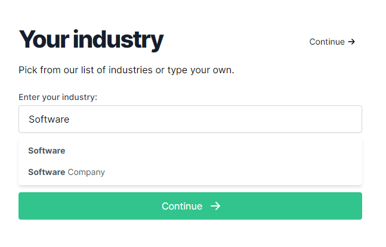
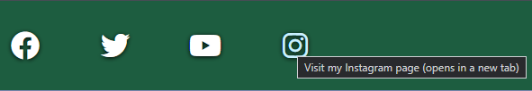

# Renterprise - The Program

***Click this banner to load the website.***

An initial prototype for a booking system. To create orders for customers and provide them with hired equipment. This example is based on a company hiring mobility equipment. However, the stock is based on what your provide to it. Flexibility is key to this software.

More people are turning to rentals as the world finances are in disarray and they can have your product at a much more managable cost. 

**This software will improve your hire bookings right from the start!**

# User Experience Design

## Target Audience
- Current business owners ready to make a change to their software.
- A consumer who is ready to take on a new challenge.

## User Stories
- I want reliable software
    1. Bug checking is imperitive.
    2. Simple but effective. Simplicity makes for fewer errors!
- I want to be able to navigate freely and quickly through the software
    1. The main menu takes you to the core details.
    2. Create the customer, find current customers and log repairs all from the main menu.
    3. You can return to the main menu at nearly all times by just entering M/m into valid fields.
    4. The process is intuitive, it guides you through.
- I want to customise my stock
- [x]  Using Google Sheets, the stock can be anything you want.
- [x]  Set a type, set a name, pricing and that is all you need.

## Wireframe Program Flow
Program flow wireframe was created using Figma[^1]. The image shows the processes through the stages of the software.
Some are still in design phase. Majority implemented.

## Logo - Redocumented from Portfolio 1.
The logo was created using the website LOGO.com[^2]. It has been pulled from my previous Renterprise project for Portfolio 1[^4].

### Logo Process - Redocumented from Portfolio 1[^4].
Using their step by step builder a full brand could be created from scratch, firstly the selection of software industry was chosen as it was accurate and appropriate.

Next, it gave an overall palette choice, blues, greens etc. Given the fact that a product is trying to be sold, and green symbolises wealth it seemed like a logical decision.

The creator then asked for a styling of the font to be used, a modern font was the best choice as it is for a modern product.

The final font choice for the logo was then made and it displayed the generated logo with it.

This was then the branding provided.

## Responsive

This was going to be impossible to fully achieve due to the terminal window being a fixed size.
Although to implement a dynamic terminal size and then dynamic code based on width would have been very problematic too.
The only device that has an issue with displaying all the content is mobile. However, this can be resolved if the device is
in **LANDSCAPE** mode.

## Breakdown of Design - Redocumented from Portfolio 1[^4].

### Colour Theme
Colour theme was initially chosen and subsequently revised with Coolors.[^3] 
The overall palette was picked with the website tools which enabled complementary and contrasting colour choices based upon the initial colour from the logo.

# Features

## Existing Features

There are a lot of existing features so it is best to separate them with their results :

---

**Change Address**

[Enter a string to change a value](readme/change-address/change-address-1.png), [or leave it blank for no change](readme/change-address/change-address-2.png). 
Here the address is changed, but the empty postcode field prevents that being changed too. Feedback is then provided to say it is updated, the change is then made in the customer display.

---

**Change Name** 

[A field can be left blank, or entered in](readme/change-address/change-name-1.png), if it is left blank. It will not update this section and it will provide feedback to say so. As seen in the previous image. 
After an update is made. It will give an "updated response" and refresh the customer display, including header, as seen [here](readme/change-address/change-name-2.png).

---

**Create Customer**

A customer being created has to have an element of flexibility. It cannot be assumed that numbers are not required in a name as this could eliminate company names from being used in this field. However, [validating again empty fields is important and that is brought to fruition within this software](readme/create-customer/create-customer-1.png)

---

**Search Customer**

[Searching for customers needs to be extensive](readme/customer-search/customer-search-init.png). Searching for multiple or individual customers based on unique or "vague" data. Vague could be referred to as searching for the name "red" but there are many iterations of first and last names for people which include this.
It needs to validate fields against [blank](readme/customer-search/customer-search-validate-none.png) and [incorrect](readme/customer-search/customer-search-validate-wrong.png) entries for choosing a search criterea. Then upon choosing the search method it has to ensure again that a [blank](readme/customer-search/customer-search-blank-search-result.png) search cannot be made. Which it does.

Depending on the result, will determine what it does next. If it is performing a [unique search such as customer number](readme/customer-search/customer-single-find-customer-number.png) you will only have one result which will [auto select the customer and go straight to their page](readme/customer-search/customer-screen-on-single-find.png).

If a [more vague search is performed](readme/customer-search/customer-search-multi-find-postcode-1.png). The user will then be further prompted to [make a choice from the results that have been found](readme/customer-search/customer-search-multi-find-postcode-2.png).

And finally, in the case of there being [no results at all](readme/customer-search/customer-search-no-results.png). The user needs to be given appropriate feedback, which it does with a striking colour change to signify a problem.

---

**Customer View**

[A straight forward display](readme/customer-view/customer-view.png) of the customers details. Shows name, address and customer number and gives the user a call to action for the menu options.

---

**Item Repair**

Upon loading the repair screen from the main menu. The user is presented with [a table holding the items in for repair](readme/item-repair/item-repair-1.png). The user will be present with varying choices which are validated for [blank](readme/item-repair/item-repair-validate-blank.png) and [incorrect](readme/item-repair/item-repair-validate-wrong.png) choices. Also depending on how many items are in for repair will determine the question asked. If [only one](readme/item-repair/item-repair-yes-no.png) is in for repair. It will simply ask to repair via Yes or No. Rather than a choice of 1 from 1.

---

**Main Menu**

[A simple yet clear menu](readme/item-repair/item-repair-yes-no.png) to explain how you can enter "M" or "m" at many points in the program to return to the main menu and start again should there be an issue. It also ensures validation against [blank](readme/main-menu/menu-validate-blank.png) and [incorrect](readme/main-menu/menu-validate-wrong.png) choices.

---

**View Orders**

A customer can have singular and multiple orders. Where they have only one order, it will immediately load them into the one order they have.
If they have [multiple orders](readme/view-orders/view-orders.png) then it will display a table where a choice is required to load an order.
If there are [no orders](readme/view-orders/no-orders.png), then the user is given appropriate feedback for this.

---

#### Making A Booking

The most complex part of the process, with multiple stages and multiple types of validation required. It is comprehensive in it's functionality.

**Choose an item type [which is validated against blank and wrong choices](readme/create-order/item/item-start-validate-no-choice.png):**

**Select an item of a type [which is validated against blank and wrong choices](readme/create-order/item/item-start-choose-validate-choice.png):**

**Choosing despatch dates:**

- [Validated against incorrect format](readme/create-order/despatch/despatch-validate-format.png)
- [Validates against time travel relative to date of booking](readme/create-order/despatch/despatch-validate-date.png)
- Blank entry, validates as an incorrect format
- [Seperate collection validation, that cannot be before delivery](readme/create-order/despatch/despatch-validate-collection.png)

As long as all the above are met successfully :

**Choosing the exact item to book:**

Once again [validated against blank and wrong choices](readme/create-order/item/final-item-pick.png)

**"Making a payment":**
NB. Not real payments for many security reasons and not for commercial gain!

Payment can be attemped on [Declining](readme/create-order/payment/payment-decline-card.png), [Stolen](readme/create-order/payment/payment-security-card.png) and [Successful](readme/create-order/payment/payment-success-feedback.png) cards.

Validation is also made, by ensuring no [blank or incorrect entries are made](readme/create-order/payment/payment-validation.png).

On a successful "payment", a response is given which shows the progress of the save and any errors (if any). 

If successful, it shows a loading animation before returning to the customer, below is the response as its saving :

### Footer - Sourced from Portfolio 1[^4]
A responsive social media links area included in the footer of the page, it scales the size of the Fontawesome[^17]
icons decreases/increases on the pages. Each one has an aria-label which describes where the link goes to and explains that it will open
in a separate window. The footer also includes the same blue hover as the menu, for consistency and clarity to the user.

#### Facebook

#### Twitter (Now "X/Twitter")

#### YouTube

#### Instagram

## Proposed Features
- Alternatives to offer if no stock available for what was requested.
- Adding a repair to the system, currently only removal happens.
- Taking a payment outside of a new order
- Showing all invoices relating to an order.
- Amending despatch dates after an order has been created.

# Testing

## PEP8 Linter

Using the Code Institute Python Linter[^100]. I ran each of my .py files through it. All came back successfully with no issues.

|  File        | Result                                                                      |
|--------------|-----------------------------------------------------------------------------|
| run.py       | [View](readme/linter/run-linter.png "Result of run.py Linter").             |
| customers.py | [View](readme/linter/customers-linter.png "Result of customers.py Linter"). |
| items.py     | [View](readme/linter/items-linter.png "Result of items.py Linter").         |
| loading.py   | [View](readme/linter/loading-linter.png "Result of loading.py Linter").     |
| orders.py    | [View](readme/linter/orders-linter.png "Result of orders.py Linter").       |

I do notice however, that in the CodeAnywhere environment it flagged up two unused variables.
This is true, the intention was to implement them but the scope would go beyond the timeframe. So they
would be part of future features.

## Manual Testing

This section is broken down into the different areas of the program and to how it is expected to function.

### Main Menu

- [x] Invalid option choice returns error?     
- [x] Invalid choice returns to the question?  
- [x] Navigates to Create Customer?            
- [x] Navigates to Search Customer?            
- [x] Navigates to Item Repair?                

### Create Customer

- [x]  Allow inputs to fields for name and address?         
- [x]  Invalid choice returns to the question?              
- [x]  Validate inputs? (Checks if not empty and responds)  
- [x]  Display process in action of adding to Google Sheet? 
- [x]  When created go to customer?                         
- [x]  Allow customer to select customer menu options?      

### Search Customer

- [x]  Validate search option choice for correct entries?           
- [x]  Validate search option choice against no entry?             
- [x]  Re-entry when failed validation on choice?                   
- [x]  "Search Input" Check for blank entry and throw error?        
- [x]  "Search Input" Ask again for input?                          
- [x]  Ask for input again into same category (eg. Customer Name)?  
- [x]  Provide feedback when searching?                             
- [x]  Show search results when available?                       
- [x]  Load customer without choice if only one order?              
- [x]  Choose customer from search result?
- [x]  Search by Customer Name?
- [x]  Search by Address?
- [x]  Search by Postcode?
- [x]  Search by Customer Number?
- [x]  Search by Order Number?
- [x]  Search by Invoice Number?
- [x]  Search by Item Number?

### Repair Item

- [x]  Display repairs list after loading from menu?
- [x]  Ask to choose repair? (1, 2, 3 ...)
- [x]  Ask if repair to be completed on one item, when only 1 available?
        (It does this by prompting Y/N/)
- [x]  Give feedback that repair is saving?
- [x]  Give feedback when repair save is complete?

### Customer Screen

#### Options - Add New Order

- [x]  Display type options?
- [x]  Validate wrong/empty type choices?
- [x]  Display item choices?
- [x]  Show available items based on type?
- [x]  Validate wrong/empty item choices?
- [x]  Display date picker?

##### Options - Add New Order - Dates

- [x]  Delivery format adhered to?
- [x]  Empty delivery invalid?
- [x]  Delivery date (eg. 33/55/2001) invalid?
- [x]  Feedback a valid delivery?
       (Does this by turning text green)
- [x]  Collection format adhered to?
- [x]  Empty Collection invalid?
- [x]  Collection date (eg. 33/55/2001) invalid?
- [x]  Feedback a valid collection?
       (Does this by going to item pick)
- [x]  Delivery before today invalid?
- [x]  Collection before today invalid?

##### Options - Add New Order - Pick an Item

- [x]  Display available items to choose from?
- [x]  Validate on choice not there?
- [x]  Validate on empty entry?

##### Options - Add New Order - Payment on order confirmation

- [x]  Clearly display details of the order for the program use?
- [x]  Display dummy cards for payment and show what will be the result of each?
- [x]  Validate empty card entry?
- [x]  Validate wrong card entry?
- [x]  Test 1111 (Decline) card?
- [x]  Test 2222 (Stolen) card?
- [x]  Test 0000 (Successful) card?

#### Options - View Orders

##### Options - View Orders - None

- [x]  View orders when none?
       (Does this by returning message to customer display)

 ##### Options - View Orders - One      

- [x]  View orders when single present?
- [x]  Display with auto select?
- [x]  Enable customer options menu?

##### Options - View Orders - Multiple   

- [x]  View orders when multiple present?
- [x]  Select option from list?
- [x]  Display order selected?
- [x]  Enable order options menu?
- [x]  Act upon choice?

#### Options - Change Name

- [x]  Change name loads choices?
- [x]  First name empty?
- [x]  First name populated?
- [x]  Last name empty?
- [x]  Last name populated?
- [x]  Feedback if no change?
- [x]  Reload after changes?

#### Options - Change Address

- [x]  Change address loads choices?
- [x]  Address line 1 empty?
- [x]  Address line 1 populated?
- [x]  Postcode empty?
- [x]  Postcode populated?
- [x]  Feedback if no change?
- [x]  Reload after changes?

#### Options - Main Menu

- [x]  Return to main menu

# Bugs & Fixes

## ISSUE 1 
With update worksheet from option 3/4 in customer file. Would not send update data.

## FIX 1 
A break was terminating the while loop when it cycled through the if/elif cycle.
So it never made it to the point at the bottom of the loop where if len(update_data) > 0:
is called. By doing this, it never send the data to the sheet. Removing the break immediately resolved the issue.

---

## ISSUE 2
Add order was initially too long at 26 lines, needed to resolve it as it would be too long for the terminal.

## FIX 2
Changed the text output to refresh and redisplay differently so customer information is still available but
regain 6 lines.

---

## ISSUE 3
get_item_row = SHEET.worksheet("items").row_values(row_id)

This although getting data works as gspread should. If there is a sequence of empty values.
It will shorten the length of the data returned. Causing a "list index out of range" error.
Would expect that "get_item_row[5]" would be in the list but have an empty value.
Researched showed that gspread trims it down to the length of the longest item in the list.
So, upon this information. The one row that is always a fixed constant is the header row.

## FIX 3
 if len(get_header_row) > len(get_item_row):
        while len(get_item_row) < len(get_header_row):
            get_item_row.append('')
Creating an if statement to check the length of the obtained list against the length of
the header list.
If it is not exact, it will continue to add empty values until the length of the headers
is no longer greater than the length of the data previously obtained.

---

## ISSUE 4
Case sensitivity on find/findAll.
When searching the Google sheets, case matching had to be performed.

## FIX 4
Looking through gspread documentation found that find/findAll has
a parameter for case_sensitive, which is set to True by default. So setting
it to false resolved this and now searching is a lot easier.

---

## ISSUE 5
- When performing the update part of item_repair()
/home/codeany/.local/lib/python3.8/site-packages/gspread/worksheet.py
:1069: UserWarning: [Deprecated][in version 6.0.0]: method signature will change to:
'Worksheet.update(value = [[]], range_name=)' arguments 'range_name' and 'values' will swap,
 values will be mandatory of type: 'list(list(...))'
  warnings.warn(
## FIX 5
Issue was in update_cell not having the query provided in a way which refered to
data, column, row. Change to update_acell which uses A1 notation then a value.
So it was H(row_index) eh. in H5, change to ""

---

## ISSUE 6
Invalid Item choice 
File "run.py", line 1579, in create_new_order
    get_item, get_alternatives = check_chosen_despatch_dates(
TypeError: cannot unpack non-iterable NoneType object
## FIX 6
Needed to put the input in a while True loop to prevent the function ending even with
a non valid response. It also then highlighted another issue further in the code where a payment card 
is selected

---

## ISSUE 7
When adding order. Returns to customer which is good. But still had "Choose card" as the prompt
## FIX 7
finalise_order_and_payment(get_item, start_date,
                           end_date, payment_amounts,
                           mod)
break <--- needed the break to terminate the while after re-entering the
finalise_order_and_payment function

# Deployment

To deploy this project:

- Fork and clone this repository to your local machine.
- Create a new Heroku app.
- In the Heroku dashboard, navigate to the app's settings and set the buildpacks to Python and NodeJS in that order.
- Connect your Heroku app to the repository by linking it to your forked copy of the repository.
- Click on the "Deploy" button in the Heroku dashboard.
- After following these steps, the app is successfully deployed to Heroku.

- NB. You would need your own Credentials from Google to operate your own google spreadsheets. Also a creds.json file would need to be implemented into your own code and added to the .gitignore.
- This creds file would then be copied and pasted into a VALUE in the Heroku App Settings.

[LIVE RENTERPRISE SOFTWARE](https://portfolio3-renterprise-b7869c717283.herokuapp.com/ "Go to Renterprise")

# Technologies Used

## Languages

- HTML5
- CSS3
- Python 3
- Google Sheets

## Frameworks, Libraries & Programs Used

- Font Awesome[^5]
- CodeAnywhere [^6]
- Figma[^1]
- Heroku [^7]

### Python Libraries :

- colorama - Providing colour in the terminal
- gspread - Allowing use of Google Sheets 
- python-cfonts - For specialised fonts in the terminal
- termcolor - Again for terminal colours, but used with the tables below.
- terminaltables - For creating tables in the terminal using ASCII

## Website Tutorials/References
- W3Schools[^10]
- Stack Overflow[^11]
- Date between dates[^12]
- Pycode[^13]

# References 
[^1]: Figma is a free website for designing storyboards and wireframes : https://www.figma.com/
[^2]: LOGO website used for creating a logo and branding from scratch for free : https://app.logo.com/
[^3]: Coolors website for creating free colour themes : https://www.coolors.com/
[^4]: Renterprise Portfolio 1 - My own web design I created as part of my first project for Code Institude. This software is an extension of the idea of Renterprise: https://github.com/jbillcliffe/portfolio1-renterprise/
[^5]: Font Awesome - A great source of free icons to use in many formats : https://www.fontawesome.com
[^6]: CodeAnywhere - A cloud based IDE allowing you to create your projects anywhere at any time : https://www.codeanywhere.com
[^7]: Heroku - A place to host projects. In this case to host the python terminal. : https://www.heroku.com

[^10]: W3Schools- Invaluable for providing details on elements and their attributes and so much HTML/CSS information : https://www.w3schools.com/
[^11]: Stack Overflow - One of the most important resources for developers[^11] : https://stackoverflow.com/
[^12]: Stack Overflow post - Here I gained the information to get one date and determine the difference between the two for hire length:https://stackoverflow.com/questions/5464410/how-to-tell-if-a-date-is-between-two-other-dates
[^13]: How to do correct formatting for PEP8 : https://peps.python.org/pep-0008/

