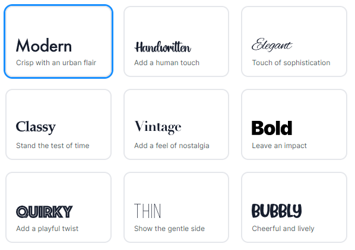
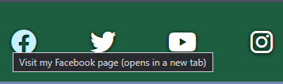

# Renterprise - The Program

***Click this banner to load the website.***

An initial prototype for a booking system. To create orders for customers and provide them with hired equipment. This example is based on a company hiring mobility equipment. However, the stock is based on what your provide to it. Flexibility is key to this software.

More people are turning to rentals as the world finances are in disarray and they can have your product at a much more managable cost. 

**This software will improve your hire bookings right from the start!**

# User Experience Design

## Target Audience
- Current business owners ready to make a change to their software.
- A consumer who is ready to take on a new challenge.

## User Stories
- I want reliable software
    1. Bug checking is imperitive.
    2. Simple but effective. Simplicity makes for fewer errors!
- I want to be able to navigate freely and quickly through the software
    1. The main menu takes you to the core details.
    2. Create the customer, find current customers and log repairs all from the main menu.
    3. You can return to the main menu at nearly all times by just entering M/m into valid fields.
    4. The process is intuitive, it guides you through.
- I want to customise my stock
    - Using Google Sheets, the stock can be anything you want.
    - Set a type, set a name, pricing and that is all you need.

## Wireframe Program Flow
Program flow wireframe was created using Figma[^1]. The image shows the processes through the stages of the software.
Some are still in design phase. Majority implemented.

## Logo
The logo was created using the website LOGO.com[^2]. It has been pulled from my previous Renterprise project for Portfolio 1.

### Logo Process - Redocumented from Portfolio 1.
Using their step by step builder a full brand could be created from scratch, firstly the selection of software industry was chosen as it was accurate and appropriate.

Next, it gave an overall palette choice, blues, greens etc. Given the fact that a product is trying to be sold, and green symbolises wealth it seemed like a logical decision.

The creator then asked for a styling of the font to be used, a modern font was the best choice as it is for a modern product.

The final font choice for the logo was then made and it displayed the generated logo with it.

This was then the branding provided.

## Breakdown of Design

### Colour Theme
Colour theme was initially chosen and subsequently revised with Coolors.[^3] 
The overall palette was picked with the website tools which enabled complementary and contrasting colour choices based upon the initial colour from the logo.

# Features

## Existing Features

### Footer
A responsive social media links area included in the footer of all the pages, it scales the size of the Fontawesome[^17]
icons decreases/increases on the pages. Each one has an aria-label which describes where the link goes to and explains that it will open
in a separate window. The footer also includes the same blue hover as the menu, for consistency and clarity to the user.

#### Facebook

#### Twitter (Now "X/Twitter")

#### YouTube

#### Instagram

### Index/Home Page
Contains the initial key information to draw in the user. A hero created from scratch (image[^7] freely sourced). Proposition cards to engage
with the website user and give them the desire to dig deeper on the website or to contact directly.

#### Hero Container/Image
A clear message right on the front of the page, issuing the first key question for most businesses - is it worth it?

#### Index Proposition Cards
Another section which has the proposition cards to again, question the user and provide more snippets of key information and increase 
website user interest. It is responsive too, to always keep the text clear across resolutions.

### Contact Form
A validated form which will ask for a name, phone number, email and the reason for their contact. 
- The name is validated by expecting a string.
- The phone, in the same way is expecting a string. *Country Code has a default of United Kingdom*
- The country codes for the phone number is populated using JSON.[^19]
- The email is expecting a string with the correct syntax, validated by html itself.
- The reason is expecting a selection. Cannot be left with no selection.

#### Name Validation

#### Phone Validation

#### Email Validation
Requiring a string

Requiring the correct syntax for an email

#### Reason Validation

#### Country Codes

#### Form Dump Response

#### Secret Thanks Page Response

### Contact Us Details
A section on the contact.html page which contains the (fictional) company address and contact details (which link to Code Institute).
The map is responsive and always centres on the location required.

The phone number and email both perform functions related to their content. Clicking on the phone number will load up the device 
calling function (such as Skype on a PC). Clicking on the email will load the default device emailing system, such as Outlook on a PC.

#### Map & Details

### Product Features Page
A page on the website that displays the features of the proposed product. Each feature clearly separated so that a prospective customer
can carefully evaluate each part of the software.

### About Page
A simple page, which has text to give a bit of detail about myself, the reasons for the software and the history of the evolution of the concept.

## Proposed Features

- Fully functioning PHP submission form within the site, including an email auto response (PHPMailer[^18] can satisfy this.) Would need deeper CodeAnywhere knowledge to install a PHP server
- Demo videos, useful for tutorials to show to other.
- Jquery phone validation based on country code selected. This was initially in the scope, but it would have become a problem.
- Chat feature, if you are selling something, you need to have a decent response time.

# Testing

## HTML and CSS Validation Tool 
The W3C Markup Validation Service[^20] was used to validate the html. Things were all in place on the GitHub Pages for testing HTML.
For the CSS, I had to copy the full style.css. Results shown in the table below.

### CSS Validation - All Passed
Only one page to validate for CSS, which is below :

### HTML Validation -- All passed
Each page needs validation :

### Contact Page HTML Validation Error

contact.html initially failed this test as there was a group in the form with no fixed label to it. 
This was amended and then retested by changing to a fieldset with a legend.
To view the remaining tests, click on each "View" below :

| Page         | URL          |                                                                                            |
| -------------| ------------ | -------------------------------------------------------------------------------------------|
| About        | about.html   | [View](assets/readme/validate/about-validated.png "about.html successful validation")      |
| Contact Fail | contact.html | [View](assets/readme/validate/contact-fail-validated.png "contact.html failed validation") |
| Contact Pass | contact.html | [View](assets/readme/validate/contact-validated.png "contact.html successful validation")  |
| Product      | product.html | [View](assets/readme/validate/product-validated.png "product.html successful validation")  |
| Thanks       | thanks.html  | [View](assets/readme/validate/thanks-validated.png "thanks.html successful validation")    |

## WAVE, Google Chrome extension.
WAVE is a measure of website issues. Some were fixable, the table below has a record of testing and fixes where applicable.

| Page         | Issues          | Solution/Final Report                                                   |
| ------------ | --------------- | ---------|---------------------------------------------------------------|
| About        | N/A                                                                                                | [View](assets/readme/wave/about-final-wave.png "about.html WAVE report")                     |
| Contact      | [View](assets/readme/wave/contact-issues.png "contact.html WAVE report with unaddressed issues")   | Orphaned label resolved by putting a fieldset on the radio group, this resolved the missing fieldset issue too. The fix creates a "missing form label" but this section as a whole is contained within the fieldset of the phone number [View](assets/readme/wave/contact-final-wave.png "contact.html final WAVE report")             |
| Index        | N/A                                                                                                | [View](assets/readme/wave/index-final-wave.png "index.html WAVE report")                     |
| Product      | Missing h1 tag [View](assets/readme/wave/product-issue.png "initial index.html WAVE report")       | add an h1 tag [View](assets/readme/wave/index-final-wave.png "index.html final WAVE report") |  
| Thanks       | N/A                                                                                                | [View](assets/readme/wave/thanks-final-wave.png "thanks.html WAVE report")                   |

One consistent issue, which remains is [The Empty Form Label](assets/readme/wave/empty-form-label.png "Empty form label in WAVE"). https://codepen.io/erikterwan/pen/EVzeRP is where I located the tutorial and under the guise of a pure CSS/HTML project, I was not overly familiar

This empty label is for an invisible checkbox. This checkbox is the trigger for the burger menu switching on and off based on media queries. At 705px the clickable label appears visible. Then based on the label click selecting or deselecting the checkbox will determine if it should show the dropdown menu.

The tutorial for this is loosely based from : https://codepen.io/erikterwan/pen/EVzeRP. 

## Lighthouse, Google Chrome Inspect (F12) Mode

Scoring for Lighthouse was done on the Index (landing) page, and what would be the most demanding page (contact.html) :
|  Page   |  Source |                                                                                                            |
| ------- | ------- | ---------------------------------------------------------------------------------------------------------- |
| Index   | Desktop | [View](assets/readme/lighthouse/index-lighthouse-desktop.png "Desktop Lighthouse score on index.html")     |
| Index   | Mobile  | [View](assets/readme/lighthouse/index-lighthouse-mobile.png "Mobile Lighthouse score on index.html")       |
| Contact | Desktop | [View](assets/readme/lighthouse/contact-lighthouse-desktop.png "Desktop Lighthouse score on contact.html") |
| Contact | Mobile  | [View](assets/readme/lighthouse/contact-lighthouse-mobile.png "Mobile Lighthouse score on contact.html")   |

The lighthouse testing did flag an issue with the iframe for the map, not having a title [View](assets/readme/lighthouse/contact-lighthouse-issue-1.png "Lighthouse missing iframe title"), remedied by adding a title to the iframe.

## Further Testing
- The Website was tested on Google Chrome, Microsoft Edge and Mozilla Firefox
- Although not viewed on multiple physical devices. Google Chrome's development console allows for a very large amount of emulated devices to be used.
- Repeated testing through each page, ensured links were correctly working on each page.

# Deployment
The steps below were followed to deploy the page to GitHub pages :

From Github, click on the repository required :

As shown in the below image, click on the settings within the repository :

Select "Pages, then select source "Deploy From Branch" and change Branch to "main" and select the "root" folder:

After refreshing and viewing again, you should (there could be a delay in the upload process) have the link to the website (hosted by GitHub) where the project is viewable :

[LIVE RENTERPRISE WEBSITE](https://jbillcliffe.github.io/portfolio1-renterprise/ "Go to Renterprise")

# Technologies Used

## Languages

- HTML5
- CSS3

## Frameworks, Libraries & Programs Used

- Google Fonts[^4]
- Font Awesome[^17]
- CodeAnywhere [^21]
- Figma[^1]
- Am I Responsive?[^22]

## Website Tutorials/References
- Button Hover Animation Tutorial (W3Schools)[^23]
- HTML/CSS Cards[^24]
- Responsive iframes, used for the map on the contact.html[^25]
- W3Schools[^26] - Invaluable for providing details on elements and their attributes and so much HTML/CSS information.

# References 
[^1]: Figma is a free website for designing storyboards and wireframes : https://www.figma.com/
[^2]: LOGO website used for creating a logo and branding from scratch for free : https://app.logo.com/
[^3]: Coolors website for creating free colour themes : https://www.coolors.com/
[^4]: Google's font listing, a very large database of free online hosted fonts : https://fonts.google.com/
[^5]: CRM Image : https://www.freepik.com/free-vector/data-center-isometric-composition_4327444.htm#page=2&query=computing&position=0&from_view=search&track=sph
[^6]: Delivery Image : https://www.freepik.com/free-vector/delivery-logos-collection-companies_2607189.htm#query=fast%20delivery&position=1&from_view=search&track=ais
[^7]:Growth Image : https://www.freepik.com/free-vector/business-success-growth-chart-arrow-concept_5129993.htm#query=business%20growth&position=1&from_view=search&track=ais
[^8]: Inventory Image : https://www.freepik.com/free-vector/conveyor-belt-warehouse-concept-illustration_37113966.htm#query=software%20inventory&position=48&from_view=search&track=ais
[^9]: Money Image : https://www.vecteezy.com/vector-art/2490867-pile-of-pound-coins-with-banknote-stuck-in-middle-banking-metaphor-can-be-used-for-landing-pages-websites-posters-mobile-apps
[^10]: Moving Forward Image :https://www.vecteezy.com/vector-art/5611491-businessmen-run-ahead-governed-by-a-business-team-and-a-leadership-concept-flat-style-cartoon-illustration-vector
[^11]: Opportunity Image : https://www.vecteezy.com/free-vector/business-opportunity
[^12]: Card Payment Image : https://www.vecteezy.com/vector-art/15881043-flat-isometric-3d-illustration-online-payment-security
[^13]: Reporting Image : https://www.freepik.com/free-vector/site-stats-concept-illustration_7140739.htm#query=CRM&position=42&from_view=search&track=sph
[^14]: Servers Image : https://www.freepik.com/free-vector/data-center-isometric-composition_4327444.htm#page=2&query=computing&position=0&from_view=search&track=sph
[^15]: Streamline AI Image : https://www.freepik.com/free-ai-image/colorful-image-road-with-lights-it_42026233.htm#query=streamline&position=2&from_view=search&track=ais_ai_generated
[^16]: Workflow Image : https://www.vecteezy.com/vector-art/10682818-receive-orders-and-prepare-to-pack-products-to-send-to-customers-beginnings-as-a-merchant-and-small-business-owner
[^17]: Fontawesome a large database of free (and premium) icons : https://www.fontawesome.com
[^18]: PHPMailer is an email creation class library for PHP : https://github.com/PHPMailer/PHPMailer
[^19]: JSON file for all the country code data so that it was not on the html page, it would been very untidy in that case. : assets/json/country.json
[^20]: W3 Validator : https://validator.w3.org/
[^21]: Cloud based IDE for development : https://app.codeanywhere.com/
[^22]: Am I Responsive? A Website designed to display a singular website at multiple resolutions : https://ui.dev/amiresponsive
[^23]: Button hover animation : https://www.w3schools.com/howto/howto_css_animate_buttons.asp
[^24]: Cards, used for proposition cards on index.html : https://www.w3schools.com/howto/howto_css_cards.asp
[^25]: Responsive iframes : https://www.w3schools.com/howto/howto_css_responsive_iframes.asp
[^26]: W3Schools, comprehensive database of information for HTML and CSS : https://www.w3schools.com/